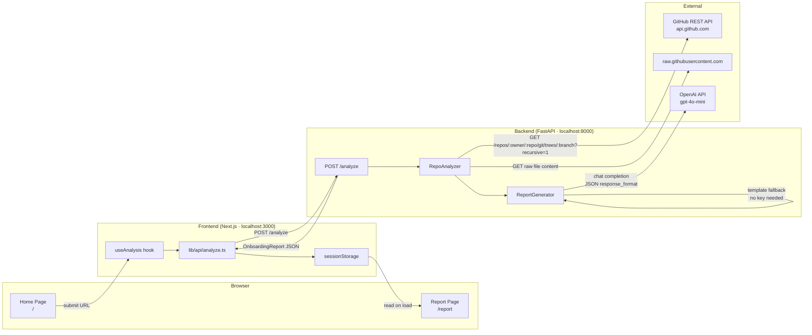

# DevPilot AI

**AI Developer Assistant for GitHub Repositories**

DevPilot AI analyzes any public GitHub repository and generates an AI-powered onboarding report that helps developers understand an unfamiliar codebase in seconds. Paste a GitHub URL, and the application fetches the repository's file tree, inspects dependency manifests, detects languages, frameworks, entry points, and API routes, then uses GPT-4o-mini (or a deterministic fallback) to produce a structured, navigable developer report rendered as rich Markdown.

---

## Table of Contents

- [Features](#features)
- [Tech Stack](#tech-stack)
- [Architecture](#architecture)
- [Repository Structure](#repository-structure)
- [Backend API](#backend-api)
- [Frontend](#frontend)
- [Environment Variables](#environment-variables)
- [Local Setup](#local-setup)
- [Running the Application](#running-the-application)
- [Testing](#testing)
- [Troubleshooting](#troubleshooting)
- [Security](#security)
- [Project Context](#project-context)
- [Future Improvements](#future-improvements)
- [License](#license)
- [Contributors](#contributors)

---

## Features

### User-Facing (Frontend)
- **Repository input form** — paste any public GitHub URL; optional branch field (auto-detected when left blank)
- **Animated analysis progress screen** — indeterminate progress bar with rotating messages while analysis runs
- **Full onboarding report page** — sticky header, sidebar navigation (desktop), scrollable tab bar (mobile), seven color-coded report sections
- **Markdown rendering** — all section content rendered with syntax highlighting, GFM tables, inline code, code blocks, and links
- **Section jump navigation** — anchor links for every section, active on both desktop sidebar and mobile tab strip
- **One-click "Analyze another repo"** — clears session state and returns to the home page
- **Client-side URL validation** — instant feedback before any network round-trip
- **Session persistence** — report is stored in `sessionStorage` so navigating back doesn't re-fetch

### Backend / Analysis Capabilities
- **Language detection** — counts files by extension across 25+ languages
- **Framework detection** — matches known package substrings from `requirements.txt`, `package.json`, `pom.xml`, `Cargo.toml`, `go.mod`, and `Gemfile`
- **Dependency extraction** — parses `requirements.txt`, `package.json` (prod + dev), `Cargo.toml`, and `go.mod`
- **Entry-point detection** — identifies common entry-point file names (`main.py`, `index.ts`, `main.go`, etc.)
- **Folder structure mapping** — nested directory tree up to depth 3
- **API route scanning** — regex-based detection of FastAPI/Flask, Express, NestJS, and Spring route decorators
- **README extraction** — first 600 characters of the repository's own README passed to the report generator
- **Auto default-branch detection** — queries GitHub's repository metadata when no branch is specified
- **Concurrent file fetching** — downloads up to 30 key files in parallel using `asyncio.gather`
- **AI-generated report (GPT-4o-mini)** — when `OPENAI_API_KEY` is set, seven Markdown sections are generated by GPT-4o-mini with a structured JSON response
- **Template fallback** — fully functional deterministic renderer used when no OpenAI key is configured
- **CORS** — configurable allowed origins via `CORS_ORIGINS` environment variable; defaults to `localhost:3000`

---

## Tech Stack

### Frontend

| Technology | Version | Purpose |
|---|---|---|
| [Next.js](https://nextjs.org/) | 16.3.6 | React framework, App Router, SSR |
| [React](https://react.dev/) | 19.2.8 | UI component library |
| TypeScript | ^5 | Static typing |
| [Tailwind CSS](https://tailwindcss.com/) | ^4 | Utility-first styling |
| [react-markdown](https://github.com/remarkjs/react-markdown) | ^10.1.0 | Markdown rendering |
| [remark-gfm](https://github.com/remarkjs/remark-gfm) | ^4.0.1 | GitHub Flavored Markdown support |
| [rehype-highlight](https://github.com/rehypejs/rehype-highlight) | ^7.0.2 | Syntax highlighting in code blocks |
| [lucide-react](https://lucide.dev/) | ^1.48.0 | Icon set |

### Backend

| Technology | Version | Purpose |
|---|---|---|
| Python | 3.10+ | Runtime |
| [FastAPI](https://fastapi.tiangolo.com/) | >=0.111 | Async REST API framework |
| [Uvicorn](https://www.uvicorn.org/) | >=0.29 | ASGI server |
| [Pydantic](https://docs.pydantic.dev/) | >=2.7 | Request/response validation and models |
| [httpx](https://www.python-httpx.org/) | >=0.27 | Async HTTP client for GitHub API calls |
| [python-dotenv](https://pypi.org/project/python-dotenv/) | >=1.0 | `.env` file loading |
| [openai](https://pypi.org/project/openai/) | >=1.30 | GPT-4o-mini report generation (optional) |
| [pytest](https://docs.pytest.org/) | >=8.0 | Test framework |
| [pytest-asyncio](https://pypi.org/project/pytest-asyncio/) | >=0.23 | Async test support |

---

## Architecture



**Data flow:**

1. The user pastes a GitHub URL (and optionally a branch) into the home page form.
2. The [`useAnalysis`](frontend/hooks/useAnalysis.ts) hook validates the URL client-side then `POST /analyze` to the backend.
3. [`RepoAnalyzer`](backend/analyzer.py) fetches the recursive git tree from the GitHub API, selects up to 30 key files (manifests, README, entry points), and downloads them concurrently.
4. [`ReportGenerator`](backend/report.py) either calls GPT-4o-mini (when `OPENAI_API_KEY` is set) or runs the deterministic template renderer to produce seven Markdown sections.
5. The `OnboardingReport` JSON is returned to the frontend, stored in `sessionStorage`, and the router navigates to `/report`.
6. The report page reads the stored report and renders each section as styled Markdown.

---

## Repository Structure

```
devpilot-ai/
├── backend/
│   ├── main.py              # FastAPI app: CORS config, endpoint definitions
│   ├── analyzer.py          # RepoAnalyzer: tree fetch, language/framework/route detection
│   ├── github_client.py     # Async GitHub REST API wrapper (httpx)
│   ├── models.py            # Pydantic models: AnalyzeRequest, AnalysisResult, OnboardingReport
│   ├── report.py            # ReportGenerator: GPT-4o-mini path + template fallback
│   ├── requirements.txt     # Python dependencies
│   ├── .env.example         # Environment variable template
│   ├── test_main.py         # Integration tests for FastAPI endpoints + CORS
│   ├── test_analyzer.py     # Unit tests for all RepoAnalyzer detection passes
│   ├── test_github_client.py# Unit tests for GitHub API wrapper (mocked transport)
│   └── test_report.py       # Unit tests for ReportGenerator (template + section parsing)
│
├── frontend/
│   ├── app/
│   │   ├── layout.tsx       # Root layout, metadata
│   │   ├── page.tsx         # Home page: URL input form + loading screen
│   │   ├── not-found.tsx    # 404 page
│   │   └── report/
│   │       └── page.tsx     # Report page: sticky header, sidebar nav, section grid
│   ├── components/
│   │   ├── home/            # HeroHeadline, RepoInputForm
│   │   ├── loading/         # AnalysisProgress (progress bar), ProgressMessages
│   │   ├── report/          # ReportHeader, SectionNav, SectionGrid, ReportSection, MarkdownContent
│   │   └── ui/              # Badge, Button, ErrorBanner, Input, Spinner
│   ├── hooks/
│   │   ├── useAnalysis.ts   # State machine: idle → loading → error; sessionStorage bridge
│   │   └── useReportSections.ts
│   ├── lib/
│   │   ├── api/
│   │   │   ├── client.ts    # Base fetch wrapper, ApiClientError, NEXT_PUBLIC_API_URL
│   │   │   ├── analyze.ts   # analyzeRepo() → POST /analyze
│   │   │   └── health.ts    # Health check helper
│   │   └── utils/
│   │       ├── validate.ts  # Client-side GitHub URL validation
│   │       └── format.ts    # Date/URL formatting helpers
│   ├── types/api.ts         # Shared TypeScript interfaces (AnalyzeRequest, OnboardingReport, …)
│   ├── constants/sections.ts# Section titles, icons, and Tailwind accent classes
│   ├── .env.local.example   # Frontend environment variable template
│   └── package.json
│
├── docs/
│   └── api-contract.md      # Full backend API contract (request/response spec)
│
├── bob_sessions/            # IBM Bob AI session screenshots from development tasks
├── pyrightconfig.json       # Pyright type-checking configuration
└── .gitignore
```

---

## Backend API

Base URL (local): `http://127.0.0.1:8000`

### `GET /`

Health check / smoke test.

**Response `200 OK`**
```json
{ "message": "DevPilot AI Backend is running 🚀" }
```

---

### `GET /health`

Liveness probe. Returns the service status.

**Response `200 OK`**
```json
{ "status": "healthy" }
```

---

### `POST /analyze`

Analyzes a GitHub repository and returns a structured onboarding report.

**Request body** (`application/json`)

| Field | Type | Required | Description |
|---|---|---|---|
| `repo_url` | `string` | ✅ | GitHub repository URL, e.g. `https://github.com/owner/repo` |
| `branch` | `string` | ❌ | Target branch. Omit to auto-detect the repository's default branch. |

**Example request**
```json
{
  "repo_url": "https://github.com/tiangolo/fastapi"
}
```

**Response `200 OK`** — [`OnboardingReport`](backend/models.py)
```json
{
  "repo_url": "https://github.com/tiangolo/fastapi",
  "repo_name": "fastapi",
  "sections": [
    { "title": "Project Overview",         "content": "…markdown…" },
    { "title": "Architecture",             "content": "…markdown…" },
    { "title": "Important Files",          "content": "…markdown…" },
    { "title": "Setup Instructions",       "content": "…markdown…" },
    { "title": "Dependencies",             "content": "…markdown…" },
    { "title": "Potential Risks",          "content": "…markdown…" },
    { "title": "Recommended First Tasks",  "content": "…markdown…" }
  ],
  "generated_at": "2025-06-01T12:00:00+00:00"
}
```

`sections` always contains exactly these 7 entries in this order. Each `content` value is a **Markdown string**.

**Error responses**

| Status | When | Example `detail` |
|---|---|---|
| `400` | Non-GitHub URL, repo not found, no owner/repo in path | `"repo_url must be a GitHub repository URL"` |
| `422` | Missing required field or Pydantic validation failure | Pydantic validation error body |
| `500` | Unexpected error during analysis or report generation | `"Analysis failed: …"` |

**Example (curl)**
```bash
curl -X POST http://127.0.0.1:8000/analyze \
  -H "Content-Type: application/json" \
  -d '{"repo_url": "https://github.com/tiangolo/fastapi"}'
```

> Analysis may take 5–20 seconds for large repositories since it fetches the full recursive git tree and downloads up to 30 files concurrently from GitHub.

---

## Frontend

### Pages / Routes

| Route | Component | Description |
|---|---|---|
| `/` | [`app/page.tsx`](frontend/app/page.tsx) | Home page — hero headline, repository URL input form, loading screen |
| `/report` | [`app/report/page.tsx`](frontend/app/report/page.tsx) | Onboarding report — sticky header, sidebar nav, seven section cards |
| `*` | [`app/not-found.tsx`](frontend/app/not-found.tsx) | 404 fallback |

### Key Components

| Component | Location | Purpose |
|---|---|---|
| `HeroHeadline` | `components/home/` | Tagline and branding on the home page |
| `RepoInputForm` | `components/home/` | GitHub URL input, optional branch toggle, submit button, error banner |
| `AnalysisProgress` | `components/loading/` | Animated progress bar and rotating status messages during analysis |
| `ReportHeader` | `components/report/` | Sticky top bar with repo name, URL link, generation timestamp, "analyze another" button |
| `SectionNav` | `components/report/` | Desktop sidebar with anchor links to each section |
| `SectionGrid` | `components/report/` | Renders all report sections in order |
| `ReportSection` | `components/report/` | Individual section card with color-coded header and Markdown body |
| `MarkdownContent` | `components/report/` | `react-markdown` wrapper with GFM, syntax highlighting, and custom styled renderers |
| `Button`, `Input`, `ErrorBanner`, `Badge`, `Spinner` | `components/ui/` | Shared primitive UI components |

### Frontend ↔ Backend Communication

The frontend communicates with the backend through a thin fetch wrapper at [`frontend/lib/api/client.ts`](frontend/lib/api/client.ts):

1. All requests go through `apiFetch<T>()` which prepends `NEXT_PUBLIC_API_URL` (defaults to `http://127.0.0.1:8000`).
2. [`analyzeRepo()`](frontend/lib/api/analyze.ts) calls `POST /analyze` with the repository URL and optional branch.
3. Non-2xx responses are caught and surfaced as `ApiClientError` with the backend's `detail` message shown directly to the user.
4. On success the `OnboardingReport` JSON is stored in `sessionStorage` under the key `devpilot_report` before navigating to `/report`.
5. The report page reads from `sessionStorage` on mount; if no report is found (direct navigation or page refresh), it redirects back to `/`.

### Environment Variables

| Variable | Default | Description |
|---|---|---|
| `NEXT_PUBLIC_API_URL` | `http://127.0.0.1:8000` | Base URL of the backend API |

---

## Environment Variables

### Backend (`backend/.env`)

Copy [`backend/.env.example`](backend/.env.example) to `backend/.env` and fill in values.

```env
# GitHub personal access token
# Raises the rate limit from 60 → 5000 requests/hour.
# Required for private repositories.
# Generate at: https://github.com/settings/tokens
GITHUB_TOKEN=your_github_personal_access_token

# OpenAI API key
# When set: GPT-4o-mini generates the onboarding report sections.
# When absent: a deterministic template renderer is used — no key required.
# Get your key at: https://platform.openai.com/api-keys
OPENAI_API_KEY=your_openai_api_key

# Allowed CORS origins (comma-separated)
# Defaults to http://localhost:3000 and http://127.0.0.1:3000 when unset.
# In production set this to your frontend domain.
CORS_ORIGINS=http://localhost:3000
```

### Frontend (`frontend/.env.local`)

Copy [`frontend/.env.local.example`](frontend/.env.local.example) to `frontend/.env.local`.

```env
# Base URL for the backend API.
# Defaults to http://127.0.0.1:8000 when unset.
NEXT_PUBLIC_API_URL=http://127.0.0.1:8000
```

---

## Local Setup

### Prerequisites

- Python 3.10 or later
- Node.js 18 or later

### Backend

```bash
cd backend

# Create and activate a virtual environment
python3 -m venv venv
source venv/bin/activate       # Windows: venv\Scripts\activate

# Install dependencies
pip install -r requirements.txt

# Create the environment file
cp .env.example .env
# Edit .env and add your GITHUB_TOKEN and/or OPENAI_API_KEY

# Start the development server
python -m uvicorn main:app --reload --port 8000
```

The backend will be available at **http://127.0.0.1:8000**.

Verify it is running:
```bash
curl http://127.0.0.1:8000/health
# → {"status":"healthy"}
```

### Frontend

Open a **new terminal** (keep the backend running):

```bash
cd frontend

# Install dependencies
npm install

# Create the environment file (optional — defaults work for local dev)
cp .env.local.example .env.local

# Start the development server
npm run dev
```

The frontend will be available at **http://localhost:3000**.

---

## Running the Application

1. **Start the backend** on port 8000 (see [Backend](#backend) above).
2. **Start the frontend** on port 3000 (see [Frontend](#frontend) above).
3. Open **http://localhost:3000** in your browser.
4. Paste any public GitHub repository URL into the input field (e.g. `https://github.com/tiangolo/fastapi`).
5. Optionally expand "Specify a branch" to target a non-default branch.
6. Click **Analyze Repository**.
7. An animated loading screen shows progress while the backend fetches and analyzes the repository (typically 5–20 seconds).
8. The **onboarding report page** loads automatically with seven sections:
   - **Project Overview** — languages, frameworks, README excerpt
   - **Architecture** — folder structure, frameworks, entry points
   - **Important Files** — entry-point paths, detected API routes
   - **Setup Instructions** — clone and setup steps
   - **Dependencies** — all detected package dependencies
   - **Potential Risks** — environment, security, and dependency considerations
   - **Recommended First Tasks** — practical next steps for a new contributor
9. Use the **sidebar** (desktop) or **tab strip** (mobile) to jump between sections.
10. Click **← Analyze another repo** to return to the home page and start a new analysis.

---

## Testing

All tests live in the `backend/` directory and use **pytest**. No frontend tests are currently present in the repository.

### Running the Test Suite

```bash
cd backend
source venv/bin/activate   # if not already active
pytest -v
```

### Test Coverage

| Test File | What It Covers |
|---|---|
| [`test_main.py`](backend/test_main.py) | FastAPI endpoints (`GET /`, `GET /health`, `POST /analyze`); CORS preflight for allowed and disallowed origins; Pydantic request validation (422); non-GitHub URL (400); happy-path with mocked `RepoAnalyzer` and `ReportGenerator`; `load_dotenv()` import ordering |
| [`test_analyzer.py`](backend/test_analyzer.py) | Language detection (counts, sorting, unknown extensions, case-insensitivity); framework detection from all manifest types; dependency extraction for `requirements.txt`, `package.json`, `Cargo.toml`, `go.mod`; key-path selection and 30-file cap; entry-point detection; folder structure mapping; API route regex; README extraction and truncation; full `analyze()` integration with mocked GitHub client |
| [`test_github_client.py`](backend/test_github_client.py) | `parse_owner_repo()` with valid URLs, `.git` suffix, trailing slash, schema-less input, invalid hosts, missing owner/repo; `fetch_default_branch()` 200 and 404 with mocked transport; `fetch_repo_tree()` 200 and 404; `fetch_file_content()` 200, 404, and oversized body (>500 KB) |
| [`test_report.py`](backend/test_report.py) | `SECTION_TITLES` constant values; `_render_template()` content for all 7 sections; `_parse_sections()` normal parse, missing-key fallback, malformed JSON; `generate()` preserves `repo_url`, `repo_name`, section count, and ISO-8601 `generated_at` timestamp |

---

## Troubleshooting

### Backend port 8000 already in use
```bash
# Find the process using port 8000
lsof -i :8000
# Kill it (replace PID with the actual process ID)
kill -9 <PID>
```
Or start on a different port and update `NEXT_PUBLIC_API_URL` in `frontend/.env.local`:
```bash
python -m uvicorn main:app --reload --port 8001
# frontend/.env.local → NEXT_PUBLIC_API_URL=http://127.0.0.1:8001
```

### Frontend port 3000 already in use
Next.js automatically tries the next available port. Check the terminal output for the actual URL, and update `CORS_ORIGINS` in `backend/.env` if it differs from `http://localhost:3000`.

### Missing environment variables
The backend **works without any environment variables** — it runs with unauthenticated GitHub API calls (60 req/hr rate limit) and falls back to the template report renderer. Set `GITHUB_TOKEN` to raise the GitHub rate limit, and `OPENAI_API_KEY` to enable AI-generated reports.

### CORS errors in the browser console
The default CORS allowlist is `http://localhost:3000` and `http://127.0.0.1:3000`. If your frontend runs on a different origin, add it to `CORS_ORIGINS` in `backend/.env`:
```env
CORS_ORIGINS=http://localhost:3000,http://localhost:3001
```

### GitHub API / authentication errors
- **404 "not found or is private"** — the repository is private. Set `GITHUB_TOKEN` in `backend/.env` with a token that has `repo` scope.
- **Rate limit exceeded** — you are making more than 60 unauthenticated requests per hour. Set `GITHUB_TOKEN` to raise the limit to 5 000 req/hr.
- **Branch not found** — the specified branch does not exist on the remote. Leave the branch field empty to let the backend auto-detect the default branch.

### OpenAI errors
- **`openai` not installed** — run `pip install openai` inside the virtual environment.
- **Invalid API key / 401** — check that `OPENAI_API_KEY` in `backend/.env` is correct.
- **No key set** — this is not an error; the app falls back to the template renderer automatically.

### Dependency installation problems
```bash
# Ensure you are using Python 3.10+
python3 --version

# Ensure the virtual environment is active before installing
source venv/bin/activate
pip install --upgrade pip
pip install -r requirements.txt
```

---

## Security

- **Never commit `.env` or `.env.local`** — both are listed in `.gitignore`.
- **Never hardcode secrets** — use environment variables for `GITHUB_TOKEN`, `OPENAI_API_KEY`, and any other sensitive values.
- **Restrict CORS in production** — set `CORS_ORIGINS` to your exact frontend domain rather than leaving it as the default localhost values.
- **GitHub tokens** — use fine-grained personal access tokens scoped to the minimum required permissions (read-only repository access is sufficient).
- **OpenAI keys** — set usage limits in the OpenAI dashboard to prevent unexpected billing.

---

## Project Context

Onboarding to an unfamiliar GitHub repository is a slow, manual process: developers read scattered READMEs, trace entry points, identify dependencies, and piece together the architecture from dozens of files. This costs real time — especially during hackathons, open-source contributions, or when joining a new team.

DevPilot AI automates this process. It treats a GitHub repository as a structured data source, extracts the signals that matter most to a new developer (languages, frameworks, entry points, API routes, dependencies, README), and condenses them into a navigable, AI-generated onboarding report. The result is a developer-ready overview that would otherwise take 20–60 minutes to assemble manually, delivered in under 20 seconds.

The deterministic template fallback means the tool is fully usable without an OpenAI API key, making it accessible and cost-free for exploratory use.

---

## Future Improvements

The following are ideas not currently implemented:

- **Private repository support via OAuth** — allow users to authenticate with GitHub through the frontend instead of requiring a server-side token
- **Streaming report generation** — stream each section as it is generated by the LLM rather than waiting for the full response
- **Multiple branch comparison** — diff the analysis output across branches
- **Report export** — download the generated report as a PDF or Markdown file
- **Caching** — cache analysis results per repository+branch+commit SHA to avoid redundant GitHub API calls
- **File content deep-dive** — allow users to click a detected entry point or route to see the relevant file snippet inline
- **Frontend test suite** — add unit and integration tests for React components and hooks
- **Docker Compose setup** — single-command startup for the full stack

---

## License

No license has currently been specified in this repository.

---

## Contributors

| Contributor | GitHub |
|---|---|
| jasin | [@jasin](https://github.com/jasin) |
| jasinAnishaa2005 | [@jasinAnishaa2005](https://github.com/jasinAnishaa2005) |
| wasi | [@wasi](https://github.com/wasi) |

> Contributor names are taken directly from `git log`. GitHub profile URLs are inferred from usernames and have not been independently verified.
